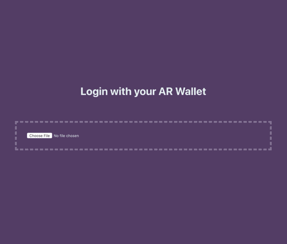

# arweave canvas draw

## 1 | Description 

Login with your AR wallet and paint on Canvas Draw. Simple painting app, minimal viable product. 



Live example at: [https://arweave.net/iERxf7S9wvoIP5KCREh6dxeHahM2zVkurNcbkNx3B50](https://arweave.net/iERxf7S9wvoIP5KCREh6dxeHahM2zVkurNcbkNx3B50)

See it in Arweave Apps: [https://arweave.net/35IFq9BcIgpSPti9YDYDiaQy4wMfMIKZ25t7hHZrhek](https://arweave.net/35IFq9BcIgpSPti9YDYDiaQy4wMfMIKZ25t7hHZrhek)

## 2 | Getting Started

Install dependencies within client.

```
cd client
yarn

```

Start the project.

```
yarn start

```


## 3 | AR Weave Deploy

### 2.2 Ready the build

Install dependencies and build the project.

```
cd client
yarn
yarn build
```

In the build folder, in `index.html` set the absolute paths to relative paths. 

Example

```
<script src="/static/js/main.2ae83226.chunk.js"></script>

// to

<script src="./static/js/main.2ae83226.chunk.js"></script>

```

Using this fix, imported images may not be supported. 

Check your project by opening `index.html` inside the build directory.

### 2.3 Ready your AR account

Create an AR wallet with AR. Wallet creation address is [https://tokens.arweave.org/](https://tokens.arweave.org/). This should provide you with a json file. 

### 2.4 Install the AR CLI

Install the CLI

```
npm install -g arweave-deploy
```

### 2.5 Use the AR CLI to Deploy your build

Load your AR json wallet file to the AR CLI.

```
arweave key-save path/to/arweave-key.json
```

Now you can run deploy commands without passing your key each time. 


Test packaging your React app build.

```
arweave package path-to/index.html packaged.html
```

If packaged.html renders as intended, deploy to the AR permaweb. 

```
arweave deploy path-to-my/index.html --package
```

Example deployment found here: [https://arweave.net/0zw_3VA0vRWHBeaJ8KKPcxPaHvYj61id3eMOg6tsFcI](https://arweave.net/0zw_3VA0vRWHBeaJ8KKPcxPaHvYj61id3eMOg6tsFcI)